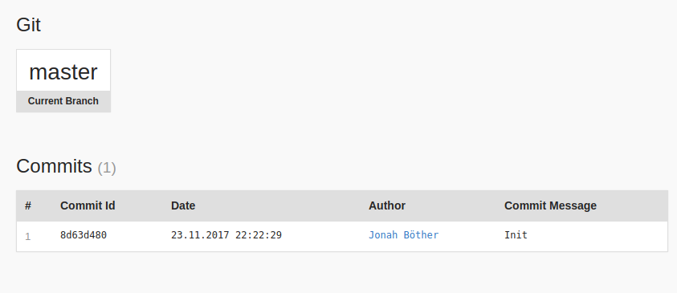

Symfony Git Information
=========================

### Install it with Composer

    composer require jbtcd/symfony-git-information
    
### Note

This plugin makes Symfony significantly slower.
Approximately 10 ms per commit to be read. By default, this means about 100 ms.

### Register into AppKernel

app/AppKernel.php :

    if (in_array($this->getEnvironment(), array('dev', 'test'))) {
        ...
        $bundles[] = new Jbtcd\SymfonyGitInformation\SymfonyGitInformation();
    }
    
### Optional Parameters

app/config/config_dev.yml :

    symfony_git_information:
        max_commits: 10
        repository_name: "Repository"
        repository_url: ""
        repository_commit_url: ""
        repository_branch_url: ""
